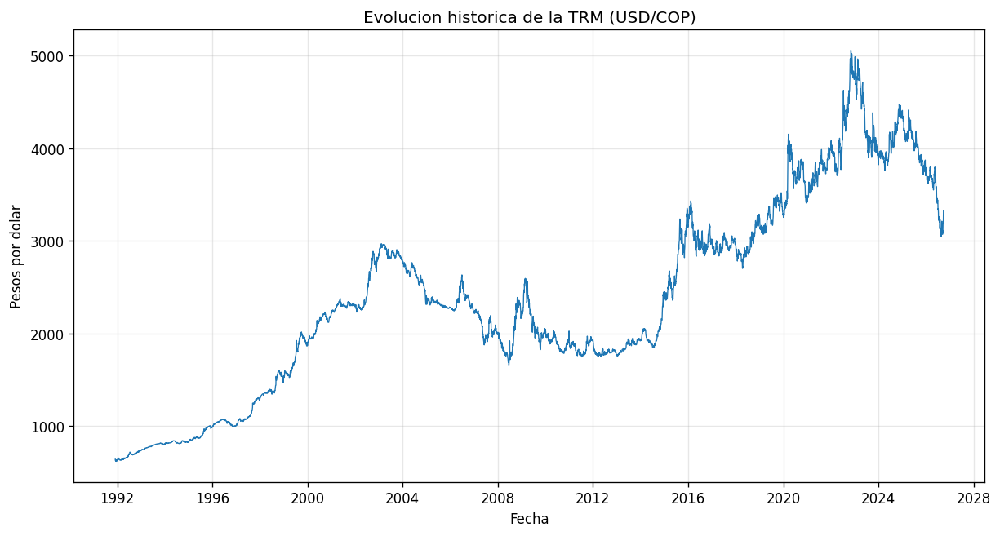
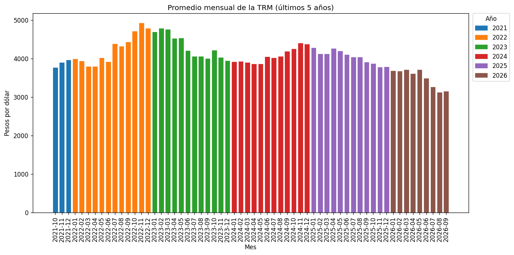

# ETL de la TRM (Tasa de Cambio Representativa del Mercado) en Colombia

Pipeline ETL que extrae, limpia, almacena y visualiza el histórico completo de la TRM (USD/COP), publicado oficialmente por la Superintendencia Financiera de Colombia.

## Caso de uso

Una empresa importadora necesita entender el comportamiento histórico del dólar en Colombia para tomar decisiones de tesorería: ¿cuándo ha sido más volátil el dólar?, ¿cómo se ha movido en los últimos años?, ¿qué tan seguido cambia realmente el valor?

Este proyecto responde esas preguntas con un pipeline reproducible, no con un análisis puntual hecho a mano.

## Fuente de datos

[Datos Abiertos Colombia](https://www.datos.gov.co) — dataset `mcec-87by`, con el histórico oficial de la TRM desde 1991. Acceso público, sin necesidad de API key.

## Estructura del repositorio

etl_trm_colombia/

├── data/

│   ├── raw/            # Datos crudos, tal como llegan de la API (no versionados)

│   └── processed/      # Datos limpios: CSV y base SQLite (no versionados)

├── src/

│   ├── extract.py      # Extract: llamadas paginadas a la API

│   ├── transform.py    # Transform: limpieza, tipado y validación

│   ├── load.py          # Load: carga a SQLite

│   └── visualize.py    # Visualize: generación de gráficas

├── notebooks/           # Scripts de exploración inicial

├── reports/figures/     # Gráficas generadas (sí versionadas)

├── main.py               # Orquesta el pipeline completo

└── requirements.txt

## Cómo correrlo

```bash
git clone https://github.com/diego5316/etl_trm_colombia.git
cd etl_trm_colombia
python -m venv .venv
.\.venv\Scripts\Activate.ps1
pip install -r requirements.txt
python main.py
```

Esto ejecuta las 4 fases en orden y genera los datos limpios en `data/processed/` y las gráficas en `reports/figures/`.

## Resultados

**Evolución histórica de la TRM (1991–presente):**



**Promedio mensual de la TRM, últimos 5 años, coloreado por año:**



## Decisiones técnicas

- **Idempotencia:** cada corrida del pipeline reemplaza los datos de salida en vez de acumularlos, así se puede ejecutar cualquier número de veces sin duplicar información.
- **Separación de fases:** cada etapa del ETL vive en su propio módulo, para poder probar y corregir cada una de forma independiente.
- **Datos crudos preservados:** `data/raw` nunca se modifica, así el pipeline puede reprocesarse sin volver a consultar la API.

## Próximos pasos

- Agregar una gráfica de volatilidad anual (desviación estándar de la TRM por año).
- Identificar y graficar los mayores saltos diarios del dólar.
- Migrar la orquestación a Airflow o un scheduler simple para automatizar corridas periódicas.
- Agregar tests automatizados para las funciones de `transform.py`.
